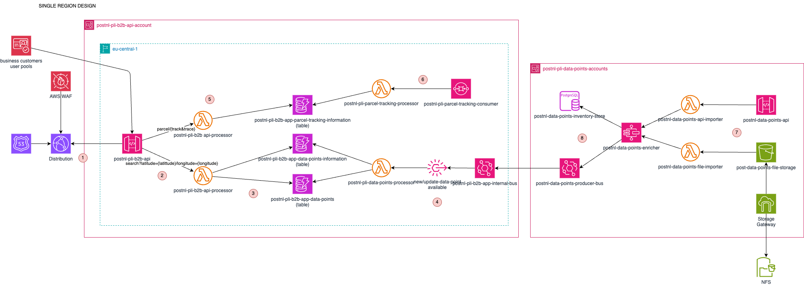

# PostNL Platform Logistical Information (PLI) IT case

## Solution design



### Introduction

This document explains the design and implementation of the solution for the PLI team at PostNL. The design aims to provide a simplified yet functional implementation, with assumptions and technological decisions made for clarity. Key architectural considerations such as scalability, monitoring, alternative solutions, and cost are discussed throughout.

The design follows similar techniques I employed during my time at PostNL and in my current role.

### 1. Business scenario.

In this scenario, we assume that the business customer is bol.com. On its platform, customers can purchase various products that need to be delivered to their homes or to PostNL pickup points. PostNL handles the delivery and manages all parcel and location data. Bol.com uses this data to enhance the customer experience by interacting with the PLI API.

During checkout, Bol.com can use the PLI API to:

1. Retrieve the nearest PostNL pickup locations where a customer can collect a parcel.
2. Provide customers with the estimated delivery time (ETA) and current parcel location after the order is placed.

For simplicity, this use case does not include the process of how Bol.com sends parcels to PostNL sorting centers. However, the same architecture can be extended to address this.

### 2. Solution design.

The solution design is explained step by step, highlighting the technical decisions, possible alternatives depending some trade-offs and the interactions between the components. For better understanding of the reader is recommended have the solution design side by side:

1. Receiving the requests
* To build the API that our business consumers can use, I decided to use full serverless technologies, starting by API Gateway. The assumption is that we are not going to receive more than 10.000 request/second. There are techniques ingest more traffic. In this scenario, there is not many requests that in first place can be cached, so it's important consideration that we have to make that if the rate of requests person and the subsequent number of Lambda executions is high, even if we reduce the execution time it's probably more cost effective to use ECS Fargate. In this use case presented, both options can be use, changing, API Gateway + Lambda for ECS Fargate. 
* Because the API Gateway will be accessible through internet, we need to take security messures for typical DDoS attacks, so we need to use AWS WAF for that matter. Depending where are our business customers are distributed we could use Cloudfront which can improve the latency, but if we deploy the API account to Frankfurt and our business costumers are residing in Netherlands or Belgium probably being at the edge locations might be not necessary for the cost of having it. 
* We will need to configure a domain with Route53.
* Another measures that we need to apply in our AWS API Gateway for business customers:
- Mutual TLS, using a custom domain and disabling the execution-api endpoint. Using client certificates (PostNL generated ones) to add extra layer of security to validate that the requester is known.
- We applied API level throttling, so we can make sure that our API Gateway throtle requests and it's not making downstream services fail, or the attackers are stopped. 
* If we want to make the setup resilient, we could deploy the same infrastructure to two regions and because we are using DynamoDB, we we use Global Table to share the same data across different regions. After that we 
could use CloudFront with application healthchecks to verify to do routing based on traffic or proximity of the user, making balance routing. 

2. Search nearest location
* I've checked in this resource `https://www.postnl.nl/en/locationfinder/?q=` where I saw that there different types of points depending on the services that they provide. I identified that each PostNL point has the following characteristis:
```
Data point
- Name
- Location (latitude, longitude)
- Address
- postal code
- city
- country
- Service
- Opening hours
- Collection time
- .. Depending on the service another properties that for simplicity I won't consider
```
* The information about the point I want to store in isolation from the geographical information which will help me to find the nearest option. Also I want to isolate the usage of that store option from the usage of this store by other downstream service, so I will need a way to synchronize the changes on that data points since they can change or add a new ones and they come from different formats (API's or files)
* The API for look as the nearest location will be the following:
```
GET /search/nearest?latitude={lat}&longitude={lon}&services={service1,service2}

| Field     | Required | Type          | Description                                            |
| --------- | -------- | ------------- | ------------------------------------------------------ |
| latitude  | yes      | float-point   |                                                        |
| longitude | yes      | float-point   |                                                        |
| services  | no       | string        | Possible values coded for services of PostNL points    |

Payload: [PostNLPoint]

| Field             | Type              | Description                                            |
| --------------    | -------------     | ------------------------------------------------------ |
| id                | UUID              |                                                        |
| location          | Location          |                                                        |
| services          | string            | Possible values coded for services of PostNL points    |
| opening_schedule  | [OpeningSchedule] | List of the opening hours per day                      |

OpeningSchedule

| Field          | Type          | Description                                            |
| -------------- | ------------- | ------------------------------------------------------ |
| day            | int           | Represents integer representation of the week day      |
| start_time     | string        |                                                        |
| end_time       | string        | Possible values coded for services of PostNL points    |
| closed         | boolean       | Represents if that week day is closed. If closed start_time and end_time will be empty   |

Location

| Field       | Type          | Description                                            |
| ----------- | ------------- | ------------------------------------------------------ |
| latitude    | float-point   |                                                        |
| longitude   | float-point   |                                                        |
| address1    | string        |                                                        |
| postal_code | string        |                                                        |
| city        | string        |                                                        |
| country     | string        |                                                        |
```
* The API endpoints receives as URL query parameterss. The latitude and longitude belongs to the home of the customer is doing the checkout in bol.com.

3. PostNL points store
*  I am using `DynamoDB with geohashing` to find the nearest possible location. The data is geohashed and store in a table where the rest of the data is store in different table to make a separation of only geolocationdata. It is possible use single table design, but for the nature of the data seems right having in two different tables. For the latency point of view is going to quite fast, because the data pattern is mainly on the hash key. Because the search vary from request to request, I did not consider at this point added a layer of caching like for instance a Redis cluster, which can be also useful for read operations. 
* The information of those tables is only use for this API Gateway and there is an isolation at the level of the account. This is important for many reasons:
    - Isolation of account makes that possible attackers only have access to certain part of the systems.
    - The DynamoDB tables do not recieve the requests from different systems that may use the same type of information, causing more hits over the same table and cross-domains access.
    - The trade-off is that we need to use event-driven architecture to update the datapoints and there exist the possibility that in some points the updates in the event does not arrive at time when the user request the information. This possibility depends on the amount of the updates in terms on PostNL points.
* The Lambda function will retrieve the geohashing data in one 1km and check if the services in different table matches with the entries.

4. PostNL points updates
* As mentioned in the case, the PostNL points are coming in different formats (API, JSON or text). In following sections I will descrive how to solve this problem, but what I designed is that where the producer of the PostNL data point sends the data of the point, it sends through an internal bus of EventBridge in different account. That event which contains the PostNL data information, will be forwarder to the api account where it will be process, convert the PostNL point location in hash and store the rest of the information in the other table. In case that the PostNL point is deleted we could have another listener that can delete the PostNL point. 

5. Retrieve ETA of parcel
* Here we have two possibilities:
- First possibility is that the customer does the checkout on bol.com and through the API the business customer creates the "track & trace" number. From there, the API that I am showing in the solution design can query a table specifically mean to hold the steps that the parcel has been doing over the lifecycle. For that, we have an event-driven integration with EBE that can send us information of the parcel. We request information on EBE to receive the information from the planner. We do that using SQS to create a subscription to EBE to events from the parcel. 
- Second possibility is that based on the parcel, the load of the system and the previous history time of the delivery and the location, we can estimated a possible ETA of the parcel. For that, we need to query a downstream system with the history of previous deliveries and estimated arrival. 
* Assuming that we can assume the track and trace to get the estimated time of the parcel, we can have the following API endpoint:
```
GET /parcel/{track&trace}

| Field        | Required | Type          | Description                                            |
| ---------    | -------- | ------------- | ------------------------------------------------------ |
| track&trace  | yes      | string        |                                                        |

Payload: Parcel

| Field             | Type              | Description                                            |
| --------------    | -------------     | ------------------------------------------------------ |
| id                | UUID              |                                                        |
| dest_postal_code  | string            |                                                        |
| dest_house_number | string            |                                                        |
| parcel_weight     | double            |                                                        |
| arrival_eta       | datetime (ISO8601)|                                                        |

```
* The DynamoDB table called `postnl-pli-b2b-app-parcel-tracking-information` contains the information of the parcel. 

6. The information of the parcel is updated by an integration that we have via SQS on EBE. The EBE can send to the queue information about the state of the parcel and the main planner information. This piece (SQS + Lambda) updates the DynamoDB giving to the user the estimated arrival time of the parcel. The parcel is continuously in movement, so we need event-driven architecture integrations to get the parcel and using an local storage mechanism to record the entries in case we want to reconstruct the whole journey of the parcel. 

7. The datapoints information is process in different account, so is isolated by the api account and can be use for downstream services. The two accounts communicate each other via an internal EventBridge bus.
We can have different types of integrations. The first integration can be through API, where an internal API is receiving request for other systems about those endpoints. Another integration use might be a NFS or SMTP volume store on the on-premise and using Storage Gateway we can share the volumes and send the files to S3 where using bucket notifications, we can process any new file comming. The files are processed by independent Lambdas where can validate the incoming information. 

8. We send the request of the Lambda to a StepFunction which can orchestrate the enrichment of the data, store the data on the final datapoint inventory store and send an event with the data point information to the EventBridge where the API account will update the DynamoDB geohash information and other relevant point information on the information table. Depending on the volumen of the datapoints, the enrichment process, it's possible to consider to use ECS Fargate task for that where an back-end application process the points and do the same job. Depending on the frequency of the update of the data and the volume might be is not need it and if latency is not an issue, simply using a buffer queue can help to ingest and process the information.

### 3. Observability.

* Logs:
    * Use CloudWatch Logs for Lambda and API Gateway.
    * Forward logs to Splunk (if available) or use CloudWatch Dashboards.
* Alarms:
    * Set alarms for Lambda failures, API Gateway throttles, and DynamoDB errors.
* Tracing:
    * Enable AWS X-Ray for distributed tracing. Alternatively, use tools like Splunk or Honeycomb for better visibility.
* Metrics:
    * Monitor request latencies, error rates, and invocation rates.

### 4. PoC

The PoC implementation will include:

* CI/CD Pipelines:
    * Use GitHub Actions for deployment to the API account.
    * Infrastructure is provisioned using AWS CDK (Python).
* API Implementation:
    * Example Lambda functions written in Python.
    * A .NET (C#) example for similar functionality.
* Testing:
    * Unit tests across the stack.
    * End-to-end tests using Robot Framework integrated into the pipeline.
